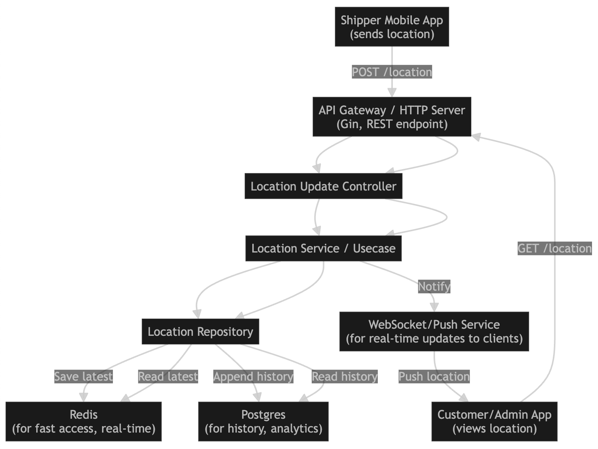

# Shipper Location API



This document describes the API endpoints for updating and retrieving the current location of a shipper in the GoDev Kit service.

## Overview

The shipper location APIs allow clients to:
- **Update** the current location of a shipper (write to Redis and DB)
- **Get** the latest location of a shipper (read from Redis, fallback to DB if cache miss)

The system uses a **cache-aside** pattern: reads go to Redis first, and if not found, fallback to the database and update the cache.

---

## 1. Update Shipper Location

- **Endpoint:** `POST /v1/redis/shipper/location`
- **Description:** Update the latest location of a shipper. Stores the location in Redis (for fast access) and appends to the database for history.

### Request Body
```json
{
  "shipper_id": "string",   // required
  "latitude": 10.762622,     // required
  "longitude": 106.660172,   // required
  "timestamp": "2025-07-09T21:00:00Z" // optional (defaults to now)
}
```

### Success Response
```json
{
  "message": "shipper location updated"
}
```

---

## 2. Get Shipper Location (Current)

- **Endpoint:** `GET /v1/redis/shipper/location/{shipper_id}`
- **Description:** Retrieve the latest location of a shipper. Tries Redis cache first; if not found, fetches from DB and updates the cache.

### Path Parameter
- `shipper_id` (string): The unique ID of the shipper.

### Success Response
```json
{
  "shipper_id": "string",
  "latitude": 10.762622,
  "longitude": 106.660172,
  "timestamp": "2025-07-09T21:00:00Z"
}
```

### Error Responses
- `400 Bad Request`: Missing or invalid shipper_id
- `404 Not Found`: No location found for the given shipper
- `500 Internal Server Error`: Unexpected error

---

## Cache-Aside Pattern

- **Write:** Updates go to both Redis (for fast reads) and the database (for durability/history).
- **Read:** Reads try Redis first. If not found, the system fetches from the database, updates Redis, and returns the result.
- **Benefit:** Fast, scalable reads with strong consistency fallback.

---

## Example Usage

### Update Location
```bash
curl -X POST http://localhost:8080/v1/redis/shipper/location \
  -H 'Content-Type: application/json' \
  -d '{
    "shipper_id": "shipper123",
    "latitude": 10.762622,
    "longitude": 106.660172
  }'
```

### Get Location
```bash
curl http://localhost:8080/v1/redis/shipper/location/shipper123
```

---

## See Also
- [Swagger UI](http://localhost:8080/swagger/index.html) for full API documentation and try-it-out.
- [README.md](./README.md) for project overview and setup. 